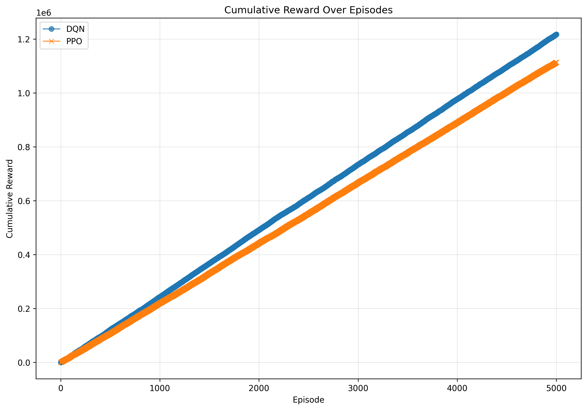
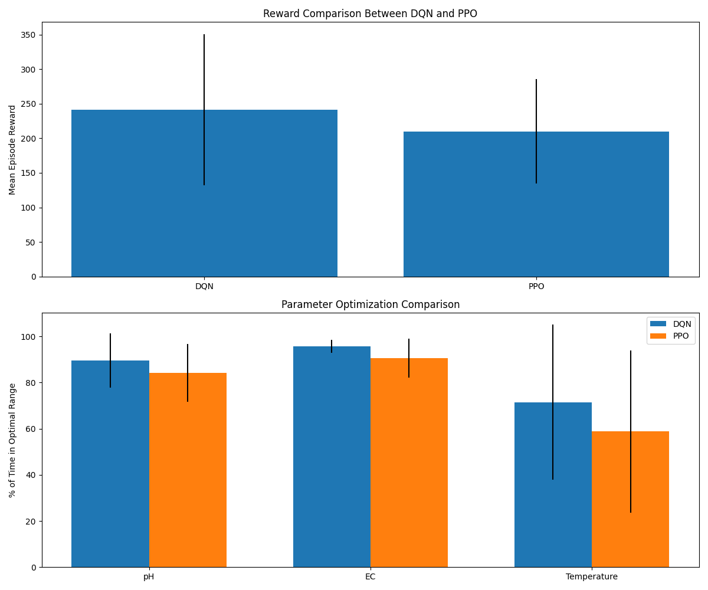

# Hydroponic Nutrient Optimization Using Reinforcement Learning

## 🌱 Introduction
This project demonstrates how **Reinforcement Learning (RL)** can be applied to optimize nutrient delivery in **hydroponic farming**. Using two popular RL algorithms—**Deep Q-Network (DQN)** and **Proximal Policy Optimization (PPO)**—we train intelligent agents to maintain ideal conditions (pH, EC, temperature) across various plant growth stages.

The agent learns to interact with a simulated hydroponic environment and make decisions that maximize plant health by adjusting:
- Nutrient concentration (EC)
- pH levels
- Water cycle durations

## 📁 Project Structure
```
project_root/
├── environment/
│   ├── custom_env.py          # Custom Gym environment (Hydroponics simulation)
│   ├── rendering.py           # Visualization using PyGame
├── training/
│   ├── dqn_training.py        # DQN training script using Stable-Baselines3
│   ├── pg_training.py         # PPO training script using Stable-Baselines3
├── models/
│   ├── dqn/                   # Saved DQN models
│   ├── dqn_tuned/             # Saved DQN models with optimized hyperparameters
│   ├── pg/                    # Saved policy gradient models
│   ├── pg_tuned/              # Saved PPO models with optimized hyperparameters
│   └── algorithm_comparison.png # Visual comparison of algorithm performances
├── report_plots/              # Visualization plots for performance analysis
│   ├── cumulative_rewards.png # Comparison of cumulative rewards
│   ├── episode_rewards.png    # Comparison of per-episode rewards
├── tuning_results/            # Results from hyperparameter optimization
│   ├── dqn/                   # DQN optimization trials
│   └── ppo/                   # PPO optimization trials
├── videos/                    # Video recordings of trained agents
│   ├── dqn_advanced.mp4       # DQN agent with metrics visualization
│   └── ppo_advanced.mp4       # PPO agent with metrics visualization
├── main.py                    # Entry point for running RL experiments
├── comprehensive_eval.py      # Comprehensive evaluation of trained models
├── visualization_report.py    # Script to generate visualization plots
├── requirements.txt           # Dependencies
└── README.md                  # Documentation
```

## ✨ Features
- ✅ Custom **Gymnasium environment** simulating a hydroponic farming system
- ✅ **State space**: pH level, EC, temperature, plant growth stage
- ✅ **Action space**: Adjust nutrients, pH levels, and water cycle duration
- ✅ Two RL algorithms implemented: **DQN** and **PPO**
- ✅ Visualization engine using **PyGame**
- ✅ Hyperparameter tuning using **Optuna**
- ✅ Performance tracking and **visualization plots**
- ✅ Video recording with **real-time metrics overlay**

## 📊 Visualizations
- **Cumulative Reward Comparison:**  
  
- **Per-Episode Reward Comparison:**  
  
- **Algorithm Comparison Chart:**  
  

## 🎥 Video Demonstrations
- **DQN Agent**: [dqn_advanced.mp4](videos/dqn_advanced.mp4)  
- **PPO Agent**: [ppo_advanced.mp4](videos/ppo_advanced.mp4)

**What to observe in the videos:**
- The environment layout: water tank, plant, sensors.
- Real-time changes in pH, EC, and water levels.
- Agent decisions and reward feedback as it learns.

## 🛠️ Installation
```bash
git clone https://github.com/SmartIsrael/agrinutrient.git
cd agrinutrient
pip install -r requirements.txt
```

## 🚀 Usage
### Training
```bash
python training/dqn_training.py         # Train DQN agent
python training/pg_training.py          # Train PPO agent
```

### Hyperparameter Tuning
```bash
python tuning/dqn_optuna.py             # Optimize DQN
python tuning/ppo_optuna.py             # Optimize PPO
```

### Training with Tuned Hyperparameters
Update `dqn_training.py` or `pg_training.py` with the best parameters from `/tuning_results` and re-run training.

### Test Trained Agents
```bash
python main.py --model dqn
python main.py --model ppo
```

### Record Agent Performance
```bash
python main.py --record --model dqn
python main.py --record --model ppo
```

### Run Comprehensive Evaluation
```bash
python comprehensive_eval.py
```

### Generate Visual Reports
```bash
python visualization_report.py
```

## 🔄 Learning Process
1. Agent observes the current hydroponic state.
2. It selects an action (adjust nutrient/pH/water).
3. The environment simulates the effect.
4. The agent receives a reward based on how close the system is to optimal.
5. Over time, it learns the best actions to maximize rewards.

## 📈 Performance Analysis
- **DQN** learns to maximize long-term rewards, achieving higher cumulative returns.
- **PPO** excels in stability and consistent learning.
- **DQN is more volatile**, but better at peak exploitation.
- **PPO converges faster** and generalizes better to unseen states.

## 📄 License
This project is licensed under the **MIT License**.

